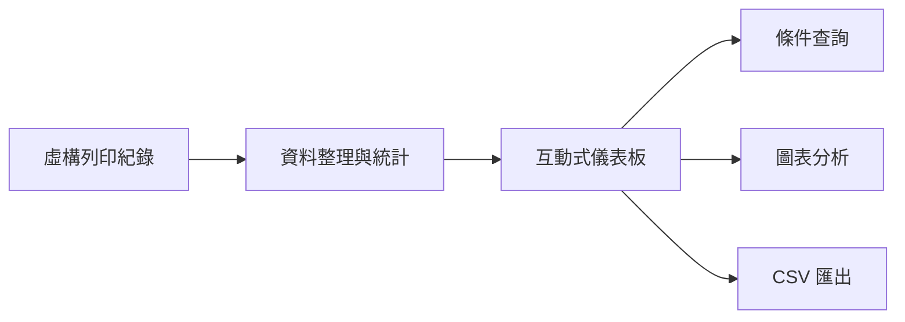

# PrintScope｜企業列印數據分析平台

PrintScope 是一套以企業列印資料分析為主題的個人作品集 Demo。專案呈現多據點報表整合、條件篩選、趨勢分析、使用排行及 CSV 匯出等功能。

[線上操作 Demo](https://wang9786.github.io/print_analytics_dashboard/)

> 本公開版本為個人重新設計的展示系統。所有名稱、資料、架構與操作情境均為虛構，不包含任職公司的原始程式碼、內部資料或機密資訊。

## 主要功能

- 依據點、月份與部門篩選資料
- 總列印量、工作數、彩色占比及成本摘要
- 每日黑白／彩色列印趨勢
- 部門與人員用量排行
- 週間與時段使用密度
- 近期列印紀錄與 CSV 匯出
- 桌面與行動裝置響應式版面

## 技術

- HTML5
- CSS3
- Vanilla JavaScript
- Canvas API
- Mock Data

## 專案定位

本作品聚焦於如何將分散的營運紀錄轉換為可查詢、可分析與可匯出的管理介面，展示需求整理、資料處理、前端互動及資訊視覺化能力。

## 系統架構

## 執行方式

此專案為純前端靜態網站，可直接開啟 `dist/index.html`，或透過 GitHub Pages 線上操作。

最後更新：2026 年 9 月
